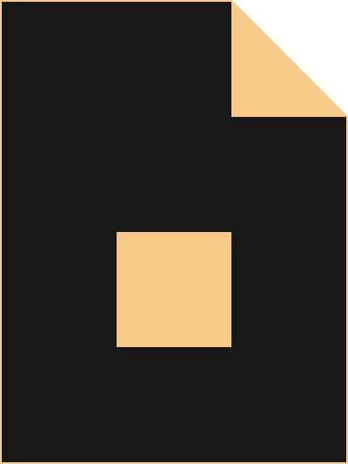

<h1 align="center"><i>Đotfiles</i></h1>

Đotfiles that <i>SuperB</i>

  

   

## About
Welcome to the `Đotfiles`:

> ...

The most **ambitious** dotfiles for unix system, configured with a high level of **optimization** for **simplicity** and **minimalism**.

## Contents
- [About](#about)
- [Contents](#contents)
- [Installation](#installation)

## Installation

`Đotfiles` use [*SuperB Bootstrap*](https://github.com/NNBnh/superb-bootstrap) to install, just download this repository then execute `bootstrap/setup`

###### For more information look at the [wiki](https://github.com/NNBnh/dots/wiki)
